# GATEMIND-AI

An AI-powered learning and assessment platform for GATE aspirants, combining mock examinations, subject-wise performance analytics, personalized learning profiles, and retrieval-augmented generation (RAG) over study material.

[](https://react.dev/)
[](https://flask.palletsprojects.com/)
[](https://www.mongodb.com/)
[](https://www.python.org/)
[](https://www.docker.com/)

## Overview

GATEMIND-AI gives students one place to prepare for GATE through structured mock tests and an AI study assistant. Students can upload notes, textbooks, question banks, and images, ask questions about that material, and receive context-grounded answers with citations. Their mock-test performance is analyzed by subject and incorporated into a personalized learning profile.

The platform also provides an administration workspace for managing users, questions, mock tests, RAG documents, analytics, and storage.

## Key Features

### Student experience

- Registration, OTP verification, login, logout, and password recovery
- JWT access and refresh-token authentication
- Student profile and preparation-progress tracking
- Published mock-test discovery, participation, and submission
- Automatic evaluation with subject-wise performance analysis
- Identification of weak and strong subjects
- Persistent RAG conversations and chat history
- Answers grounded in uploaded documents with source citations
- Upload and query PDF, TXT, Markdown, CSV, JSON, PNG, JPG, JPEG, and WebP files
- Markdown, tables, code, and mathematical-expression rendering

### Administration

- Secure administrator registration and authentication
- Role-aware staff management
- Question-bank and mock-test management
- Test publication and result monitoring
- RAG document indexing and deletion
- User, content, and performance dashboards
- Audit logging and controlled storage cleanup

### AI and retrieval

- Configurable OpenAI, Groq, and Hugging Face integrations
- Deterministic local fallback when external AI credentials are unavailable
- Parser factory for multiple document types
- Recursive document chunking
- Configurable embedding provider
- Hybrid semantic and lexical retrieval
- Metadata and document-level filtering
- Reranking, context construction, and citation generation
- Student-profile-aware response context
# GATEMIND-AI System Architecture

## 1. Overall System Architecture

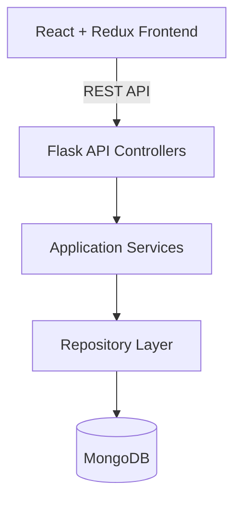
```mermaid
flowchart TD
    CLIENT["React + Redux Frontend"]
    API["Flask API Controllers"]
    SERVICES["Application Services"]
    REPOSITORIES["Repository Layer"]
    DATABASE[("MongoDB")]

    CLIENT -->|"REST API"| API
    API --> SERVICES
    SERVICES --> REPOSITORIES
    REPOSITORIES --> DATABASE
```

---

## 2. Authentication Service Architecture

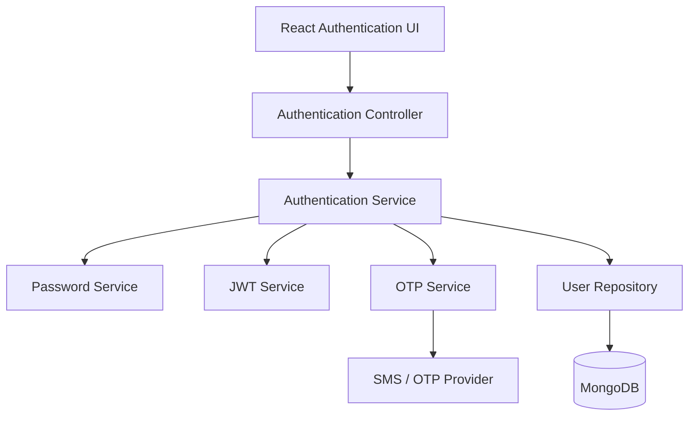
```mermaid
flowchart TD
    CLIENT["React Authentication UI"]
    API["Authentication Controller"]
    AUTH["Authentication Service"]

    PASSWORD["Password Service"]
    JWT["JWT Service"]
    OTP["OTP Service"]

    USER_REPO["User Repository"]
    DB[("MongoDB")]
    SMS["SMS / OTP Provider"]

    CLIENT --> API
    API --> AUTH

    AUTH --> PASSWORD
    AUTH --> JWT
    AUTH --> OTP
    AUTH --> USER_REPO

    OTP --> SMS
    USER_REPO --> DB
```

### Registration and OTP Flow

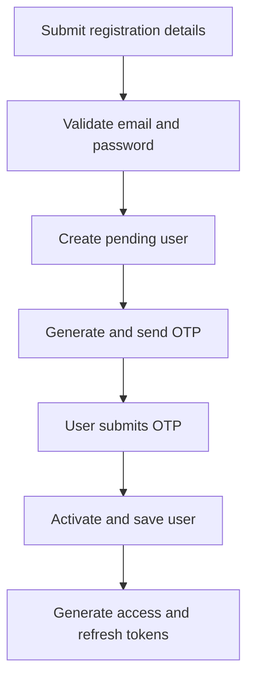
```mermaid
flowchart TD
    START["Submit registration details"]
    VALIDATE["Validate email and password"]
    CREATE["Create pending user"]
    SEND["Generate and send OTP"]
    VERIFY["User submits OTP"]
    SAVE["Activate and save user"]
    TOKEN["Generate access and refresh tokens"]

    START --> VALIDATE
    VALIDATE --> CREATE
    CREATE --> SEND
    SEND --> VERIFY
    VERIFY --> SAVE
    SAVE --> TOKEN
```

### Login Flow

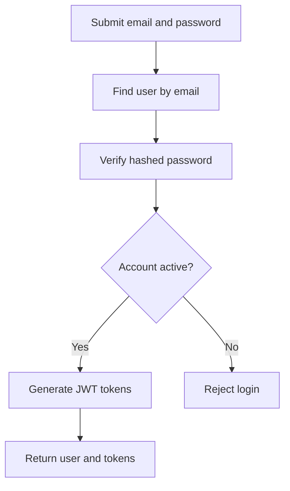
```mermaid
flowchart TD
    LOGIN["Submit email and password"]
    FIND["Find user by email"]
    CHECK["Verify hashed password"]
    STATUS{"Account active?"}
    TOKENS["Generate JWT tokens"]
    RESPONSE["Return user and tokens"]
    DENIED["Reject login"]

    LOGIN --> FIND
    FIND --> CHECK
    CHECK --> STATUS
    STATUS -->|"Yes"| TOKENS
    STATUS -->|"No"| DENIED
    TOKENS --> RESPONSE
```

---

## 3. User Service Architecture

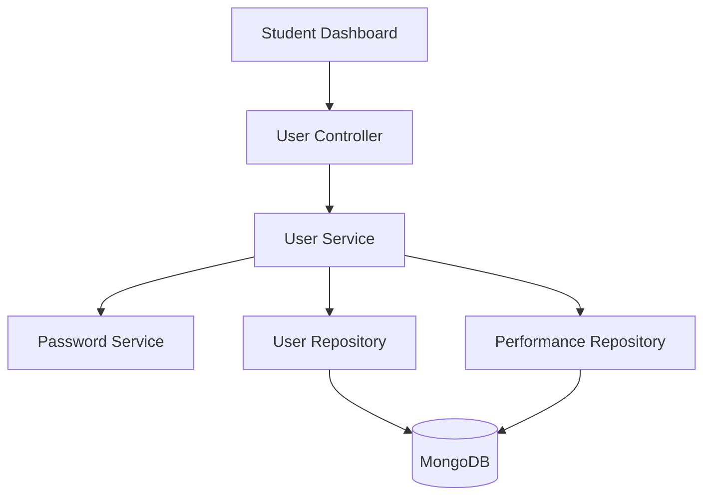
```mermaid
flowchart TD
    UI["Student Dashboard"]
    USER_API["User Controller"]
    USER_SERVICE["User Service"]

    PASSWORD["Password Service"]
    USER_REPO["User Repository"]
    PERFORMANCE_REPO["Performance Repository"]

    DB[("MongoDB")]

    UI --> USER_API
    USER_API --> USER_SERVICE

    USER_SERVICE --> PASSWORD
    USER_SERVICE --> USER_REPO
    USER_SERVICE --> PERFORMANCE_REPO

    USER_REPO --> DB
    PERFORMANCE_REPO --> DB
```

### Profile Update Flow

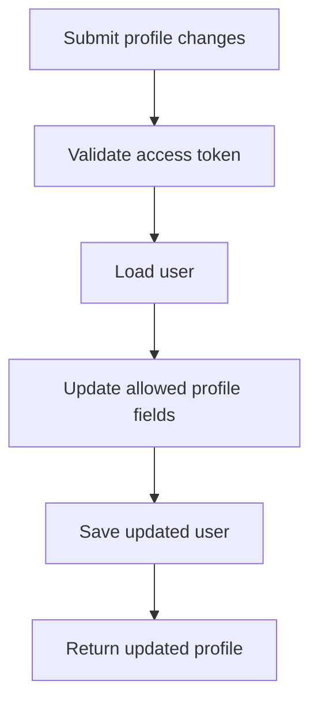
```mermaid
flowchart TD
    REQUEST["Submit profile changes"]
    AUTH["Validate access token"]
    LOAD["Load user"]
    UPDATE["Update allowed profile fields"]
    SAVE["Save updated user"]
    RESPONSE["Return updated profile"]

    REQUEST --> AUTH
    AUTH --> LOAD
    LOAD --> UPDATE
    UPDATE --> SAVE
    SAVE --> RESPONSE
```

---

## 4. Admin Service Architecture

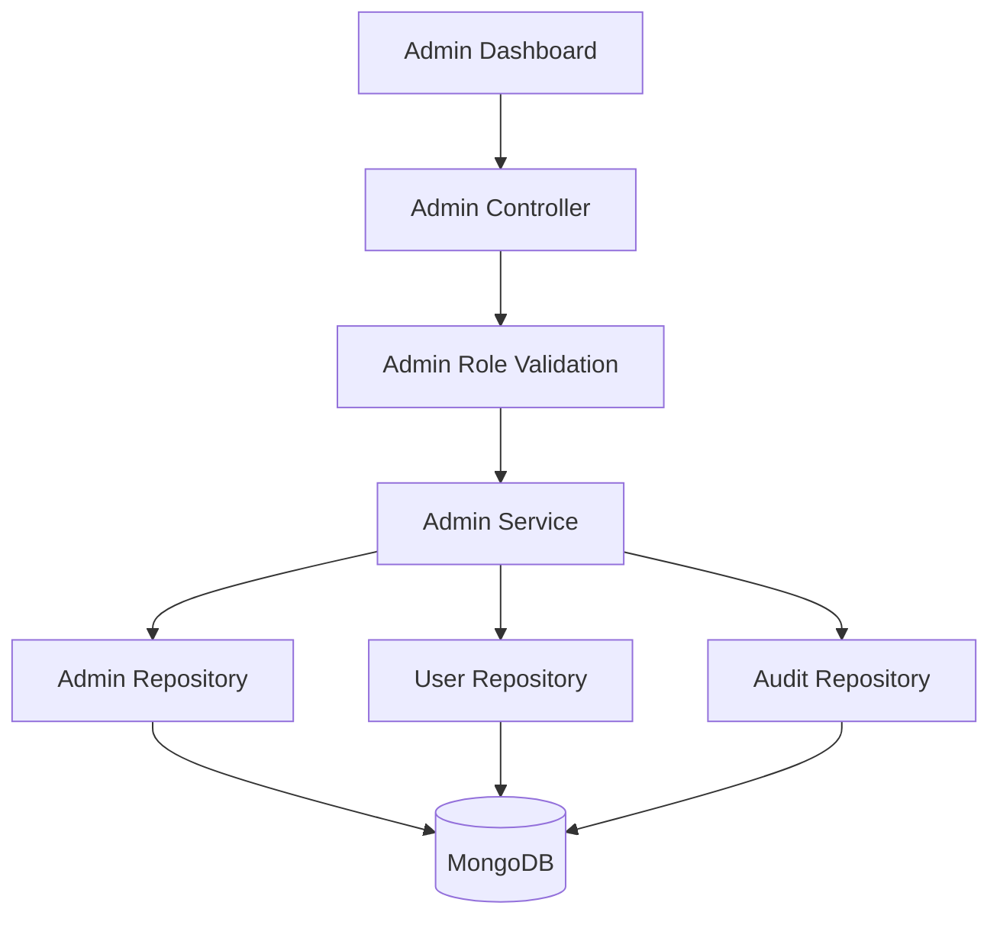
```mermaid
flowchart TD
    UI["Admin Dashboard"]
    ADMIN_API["Admin Controller"]
    RBAC["Admin Role Validation"]
    ADMIN_SERVICE["Admin Service"]

    ADMIN_REPO["Admin Repository"]
    USER_REPO["User Repository"]
    AUDIT_REPO["Audit Repository"]

    DB[("MongoDB")]

    UI --> ADMIN_API
    ADMIN_API --> RBAC
    RBAC --> ADMIN_SERVICE

    ADMIN_SERVICE --> ADMIN_REPO
    ADMIN_SERVICE --> USER_REPO
    ADMIN_SERVICE --> AUDIT_REPO

    ADMIN_REPO --> DB
    USER_REPO --> DB
    AUDIT_REPO --> DB
```

### Admin Request Flow

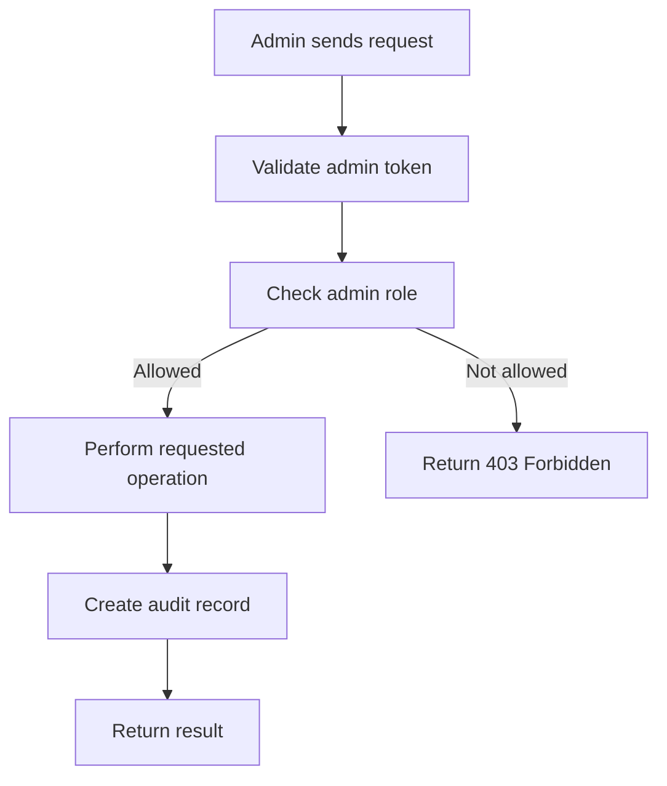
```mermaid
flowchart TD
    REQUEST["Admin sends request"]
    TOKEN["Validate admin token"]
    ROLE["Check admin role"]
    ACTION["Perform requested operation"]
    AUDIT["Create audit record"]
    RESPONSE["Return result"]
    DENY["Return 403 Forbidden"]

    REQUEST --> TOKEN
    TOKEN --> ROLE
    ROLE -->|"Allowed"| ACTION
    ROLE -->|"Not allowed"| DENY
    ACTION --> AUDIT
    AUDIT --> RESPONSE
```

---

## 5. Question-Bank Service Architecture

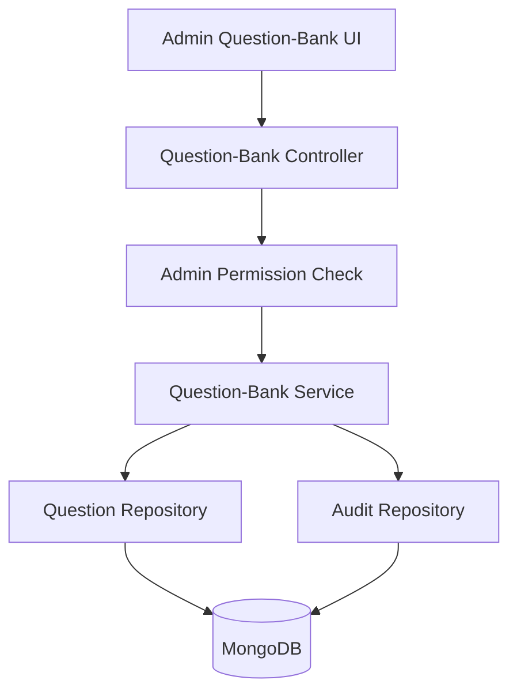
```mermaid
flowchart TD
    UI["Admin Question-Bank UI"]
    API["Question-Bank Controller"]
    RBAC["Admin Permission Check"]
    SERVICE["Question-Bank Service"]

    QUESTION_REPO["Question Repository"]
    AUDIT_REPO["Audit Repository"]
    DB[("MongoDB")]

    UI --> API
    API --> RBAC
    RBAC --> SERVICE

    SERVICE --> QUESTION_REPO
    SERVICE --> AUDIT_REPO

    QUESTION_REPO --> DB
    AUDIT_REPO --> DB
```

### Question Creation Flow

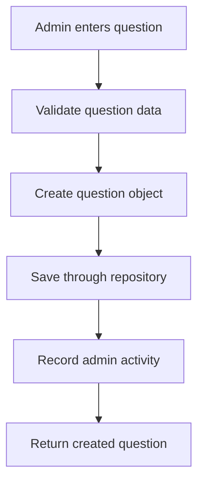
```mermaid
flowchart TD
    INPUT["Admin enters question"]
    VALIDATE["Validate question data"]
    MODEL["Create question object"]
    SAVE["Save through repository"]
    AUDIT["Record admin activity"]
    RESULT["Return created question"]

    INPUT --> VALIDATE
    VALIDATE --> MODEL
    MODEL --> SAVE
    SAVE --> AUDIT
    AUDIT --> RESULT
```

### Mock-Test Creation Flow

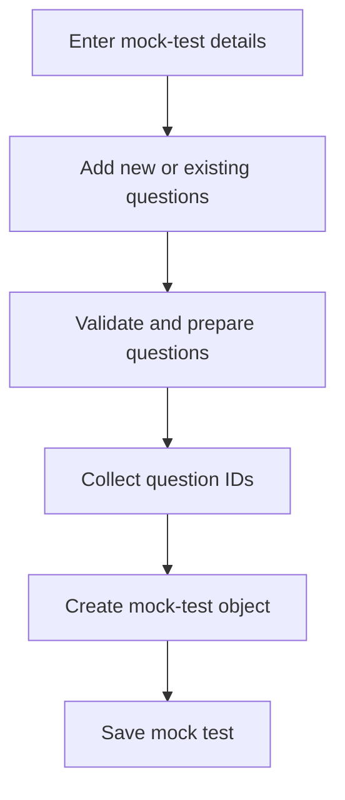
```mermaid
flowchart TD
    DETAILS["Enter mock-test details"]
    QUESTIONS["Add new or existing questions"]
    PREPARE["Validate and prepare questions"]
    IDS["Collect question IDs"]
    TEST["Create mock-test object"]
    SAVE["Save mock test"]

    DETAILS --> QUESTIONS
    QUESTIONS --> PREPARE
    PREPARE --> IDS
    IDS --> TEST
    TEST --> SAVE
```

---

## 6. Mock-Test Evaluation Service Architecture

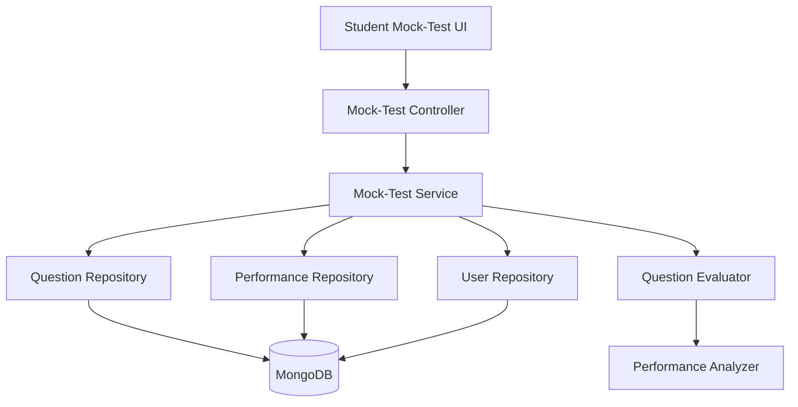
```mermaid
flowchart TD
    UI["Student Mock-Test UI"]
    API["Mock-Test Controller"]
    SERVICE["Mock-Test Service"]

    EVALUATOR["Question Evaluator"]
    ANALYZER["Performance Analyzer"]

    QUESTION_REPO["Question Repository"]
    PERFORMANCE_REPO["Performance Repository"]
    USER_REPO["User Repository"]
    DB[("MongoDB")]

    UI --> API
    API --> SERVICE

    SERVICE --> QUESTION_REPO
    SERVICE --> EVALUATOR
    EVALUATOR --> ANALYZER

    SERVICE --> PERFORMANCE_REPO
    SERVICE --> USER_REPO

    QUESTION_REPO --> DB
    PERFORMANCE_REPO --> DB
    USER_REPO --> DB
```

### Mock-Test Submission Flow

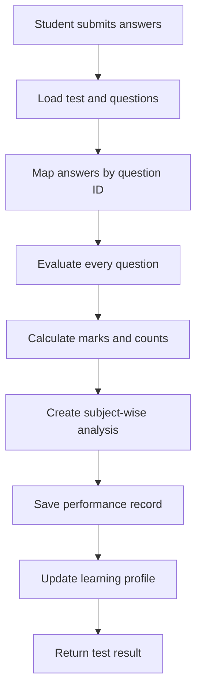
```mermaid
flowchart TD
    SUBMIT["Student submits answers"]
    LOAD["Load test and questions"]
    MAP["Map answers by question ID"]
    EVALUATE["Evaluate every question"]
    SCORE["Calculate marks and counts"]
    SUBJECT["Create subject-wise analysis"]
    RECORD["Save performance record"]
    PROFILE["Update learning profile"]
    RESULT["Return test result"]

    SUBMIT --> LOAD
    LOAD --> MAP
    MAP --> EVALUATE
    EVALUATE --> SCORE
    SCORE --> SUBJECT
    SUBJECT --> RECORD
    RECORD --> PROFILE
    PROFILE --> RESULT
```

---

## 7. RAG Document Indexing Service

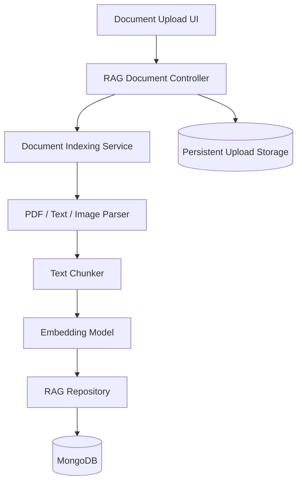
```mermaid
flowchart TD
    UI["Document Upload UI"]
    API["RAG Document Controller"]
    INDEXER["Document Indexing Service"]

    STORAGE[("Persistent Upload Storage")]
    PARSER["PDF / Text / Image Parser"]
    CHUNKER["Text Chunker"]
    EMBEDDING["Embedding Model"]
    RAG_REPO["RAG Repository"]
    DB[("MongoDB")]

    UI --> API
    API --> INDEXER
    API --> STORAGE

    INDEXER --> PARSER
    PARSER --> CHUNKER
    CHUNKER --> EMBEDDING
    EMBEDDING --> RAG_REPO
    RAG_REPO --> DB
```

### Document Indexing Flow

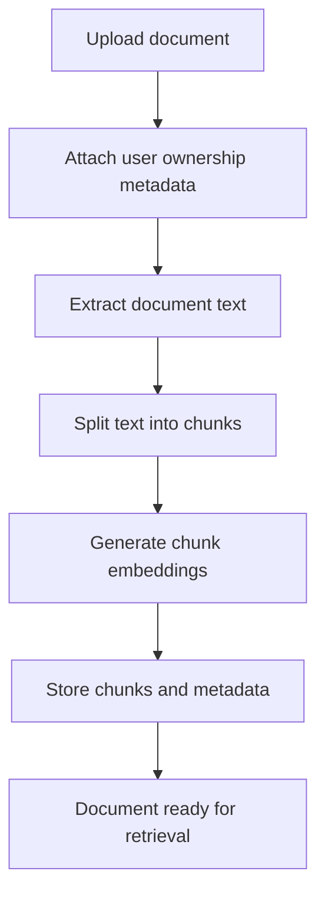
```mermaid
flowchart TD
    UPLOAD["Upload document"]
    OWNERSHIP["Attach user ownership metadata"]
    PARSE["Extract document text"]
    SPLIT["Split text into chunks"]
    EMBED["Generate chunk embeddings"]
    STORE["Store chunks and metadata"]
    READY["Document ready for retrieval"]

    UPLOAD --> OWNERSHIP
    OWNERSHIP --> PARSE
    PARSE --> SPLIT
    SPLIT --> EMBED
    EMBED --> STORE
    STORE --> READY
```

---

## 8. RAG Chat Service Architecture

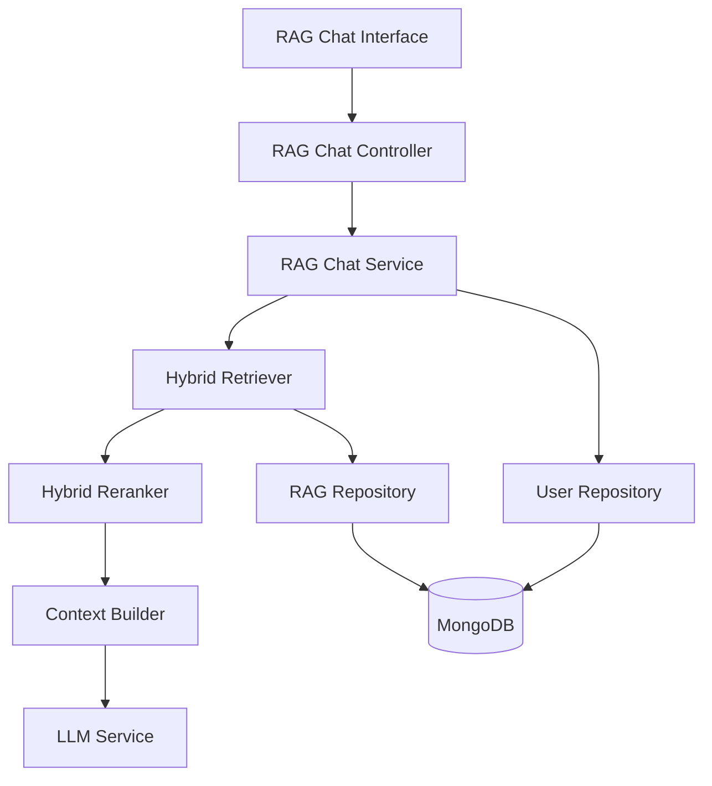
```mermaid
flowchart TD
    UI["RAG Chat Interface"]
    API["RAG Chat Controller"]
    CHAT["RAG Chat Service"]

    RETRIEVER["Hybrid Retriever"]
    RERANKER["Hybrid Reranker"]
    CONTEXT["Context Builder"]
    LLM["LLM Service"]

    RAG_REPO["RAG Repository"]
    USER_REPO["User Repository"]
    DB[("MongoDB")]

    UI --> API
    API --> CHAT

    CHAT --> RETRIEVER
    RETRIEVER --> RAG_REPO
    RETRIEVER --> RERANKER
    RERANKER --> CONTEXT

    CHAT --> USER_REPO
    CONTEXT --> LLM

    RAG_REPO --> DB
    USER_REPO --> DB
```

### RAG Question-Answering Flow

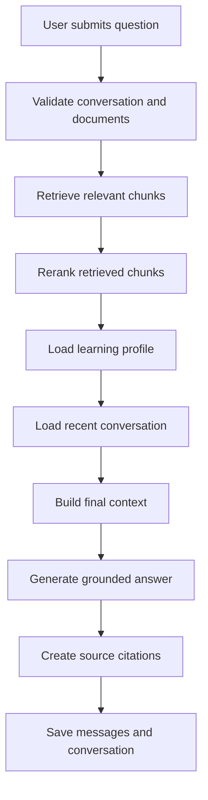
```mermaid
flowchart TD
    QUESTION["User submits question"]
    VERIFY["Validate conversation and documents"]
    RETRIEVE["Retrieve relevant chunks"]
    RERANK["Rerank retrieved chunks"]
    PROFILE["Load learning profile"]
    HISTORY["Load recent conversation"]
    CONTEXT["Build final context"]
    GENERATE["Generate grounded answer"]
    CITATIONS["Create source citations"]
    SAVE["Save messages and conversation"]

    QUESTION --> VERIFY
    VERIFY --> RETRIEVE
    RETRIEVE --> RERANK
    RERANK --> PROFILE
    PROFILE --> HISTORY
    HISTORY --> CONTEXT
    CONTEXT --> GENERATE
    GENERATE --> CITATIONS
    CITATIONS --> SAVE
```

### Hybrid Retrieval Flow

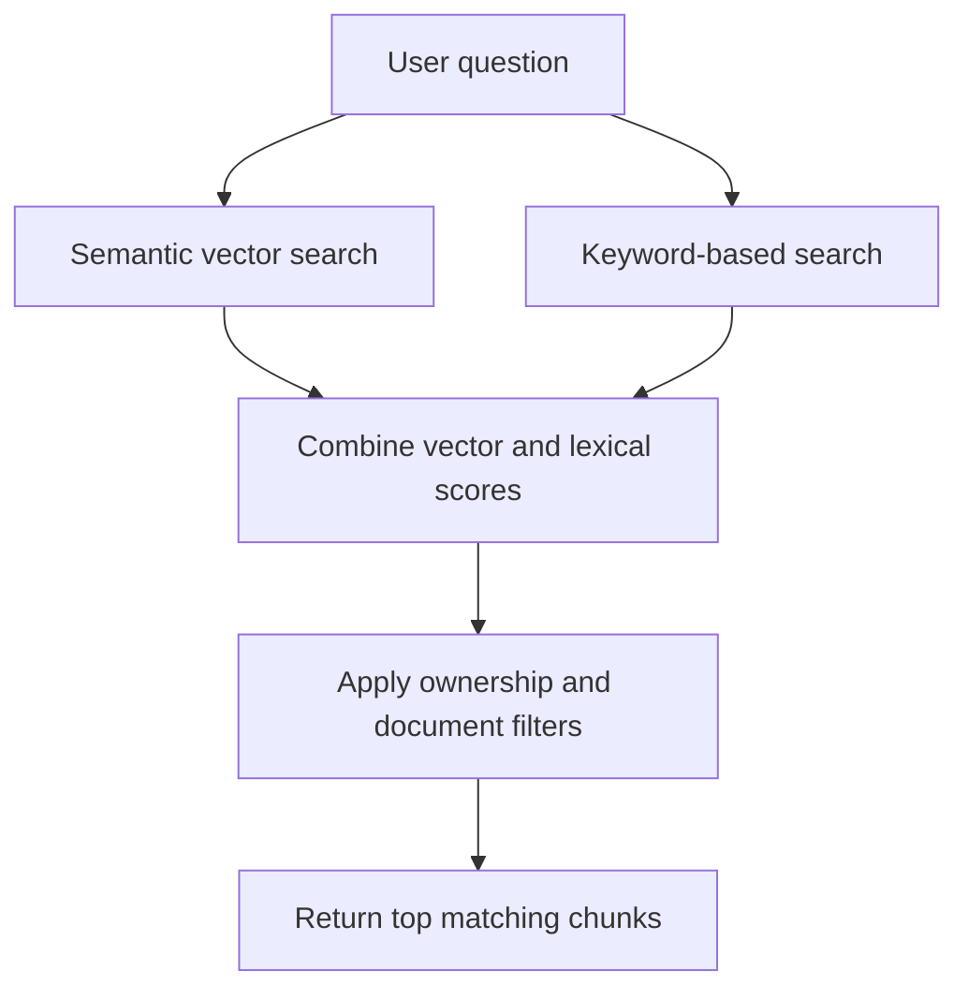
```mermaid
flowchart TD
    QUERY["User question"]
    VECTOR["Semantic vector search"]
    LEXICAL["Keyword-based search"]
    COMBINE["Combine vector and lexical scores"]
    FILTER["Apply ownership and document filters"]
    RESULTS["Return top matching chunks"]

    QUERY --> VECTOR
    QUERY --> LEXICAL
    VECTOR --> COMBINE
    LEXICAL --> COMBINE
    COMBINE --> FILTER
    FILTER --> RESULTS
```

---

## 9. Shared Security Architecture

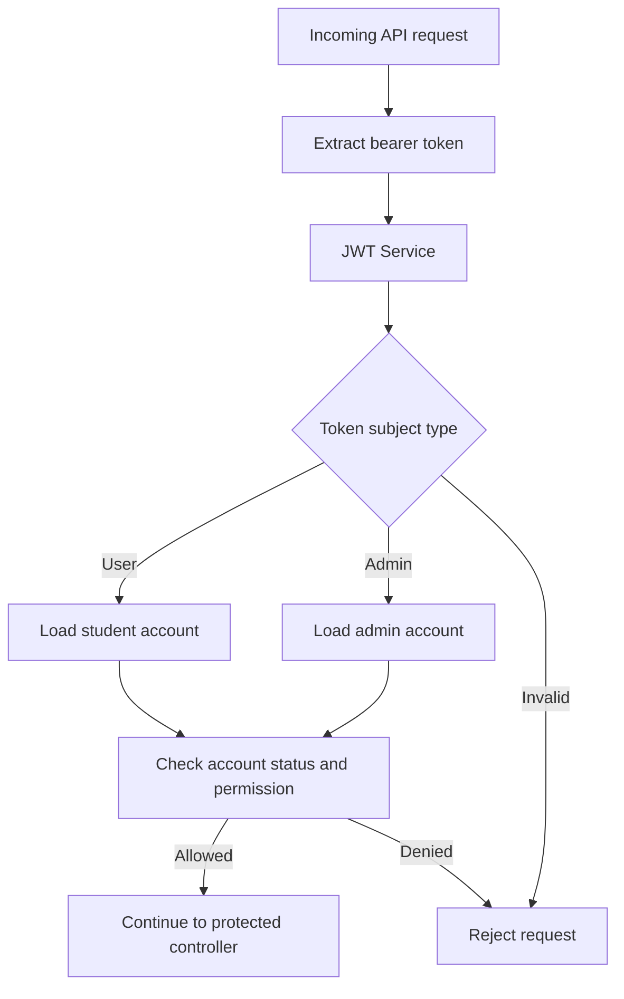
```mermaid
flowchart TD
    REQUEST["Incoming API request"]
    BEARER["Extract bearer token"]
    JWT["JWT Service"]
    SUBJECT{"Token subject type"}
    USER["Load student account"]
    ADMIN["Load admin account"]
    PERMISSION["Check account status and permission"]
    CONTROLLER["Continue to protected controller"]
    REJECT["Reject request"]

    REQUEST --> BEARER
    BEARER --> JWT
    JWT --> SUBJECT

    SUBJECT -->|"User"| USER
    SUBJECT -->|"Admin"| ADMIN
    SUBJECT -->|"Invalid"| REJECT

    USER --> PERMISSION
    ADMIN --> PERMISSION

    PERMISSION -->|"Allowed"| CONTROLLER
    PERMISSION -->|"Denied"| REJECT
```

---

## 10. Repository and Persistence Architecture

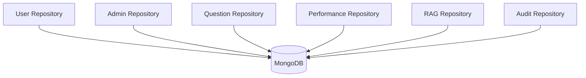
```mermaid
flowchart TD
    USER["User Repository"]
    ADMIN["Admin Repository"]
    QUESTION["Question Repository"]
    PERFORMANCE["Performance Repository"]
    RAG["RAG Repository"]
    AUDIT["Audit Repository"]
    DB[("MongoDB")]

    USER --> DB
    ADMIN --> DB
    QUESTION --> DB
    PERFORMANCE --> DB
    RAG --> DB
    AUDIT --> DB
```

---

## 11. Deployment Architecture

```mermaid
flowchart TD
    DEVELOPER["Developer pushes code"]
    GITHUB["GitHub Repository"]
    CI["GitHub Actions Backend CI"]
    DEPLOY["Deployment Workflow"]
    EC2["AWS EC2 Server"]

    DOCKER["Docker Compose"]
    BACKEND["Flask + Gunicorn Container"]
    UPLOADS[("Persistent Upload Volume")]
    MONGO[("MongoDB")]
    PROVIDERS["LLM and OTP Providers"]

    DEVELOPER --> GITHUB
    GITHUB --> CI
    CI -->|"Tests pass"| DEPLOY
    DEPLOY -->|"SSH and SCP"| EC2

    EC2 --> DOCKER
    DOCKER --> BACKEND

    BACKEND --> UPLOADS
    BACKEND --> MONGO
    BACKEND --> PROVIDERS
```

The backend follows a layered structure:

```text
backend/app/
├── controllers/       # Flask blueprints and HTTP request handling
├── models/            # Domain entities and enums
├── repositories/      # MongoDB persistence adapters
├── schemas/           # API serialization
├── services/
│   ├── admin/          # Admin authentication, analytics, and auditing
│   ├── auth/           # Student authentication workflows
│   ├── mocktest/       # Test evaluation and performance analysis
│   ├── notifications/  # SMS and email adapters
│   ├── rag/            # Parsing, chunking, embeddings, retrieval, and LLMs
│   ├── security/       # Password and JWT services
│   ├── users/          # User profile operations
│   └── verification/   # OTP verification
└── utils/              # Middleware, logging, and API response helpers
```

The implementation uses Factory, Strategy, Adapter, Template Method, Builder, repository, and observer-style patterns to keep infrastructure and business logic independently testable.

## Low-Level Design (LLD)

GATEMIND-AI is organized around small, focused classes instead of placing HTTP handling, business rules, database queries, and AI logic in a single module. Its low-level design separates responsibilities through interfaces, service composition, dependency injection, and established design patterns.
### Design patterns used
### LLD Design Patterns Used

| Exact function/class name | LLD design pattern | Why it is used |
|---|---|---|
| `create_app()` | Application Factory, Composition Root, Dependency Injection | Creates the Flask application, constructs dependencies, and injects repositories and services from one central location. |
| `UserRepository` | Repository, Dependency Inversion | Defines an abstract contract so business services do not depend directly on MongoDB. |
| `MongoUserRepository` | Repository, Adapter | Implements the repository contract and adapts MongoDB operations for the service layer. |
| `MongoUserRepository.save()` | Repository, Data Mapper | Converts a user object into a MongoDB document and stores it. |
| `MongoUserRepository.find_by_email()` | Repository, Data Mapper | Retrieves a MongoDB document by email and converts it into a user object. |
| `MongoUserRepository.find_by_id()` | Repository, Data Mapper | Retrieves a MongoDB document by ID and converts it into a user object. |
| `MongoUserRepository.update()` | Repository, Data Mapper | Converts user changes into a database update operation. |
| `MongoUserRepository.delete()` | Repository | Hides the MongoDB deletion operation from the service layer. |
| `MongoUserRepository.exists_by_email()` | Repository | Encapsulates the database query used to check whether an email already exists. |
| `MongoUserRepository.find_by_refresh_token()` | Repository, Data Mapper | Finds a user through a refresh token and converts the stored document into a domain object. |
| `MongoUserRepository.find_all()` | Repository, Data Mapper | Retrieves multiple MongoDB documents and converts them into user objects. |
| `MongoUserRepository.count()` | Repository | Encapsulates the database operation used to count users. |
| `AuthenticationService` | Service Layer, Facade, Dependency Injection | Centralizes authentication workflows while receiving repositories and security utilities as dependencies. |
| `AuthenticationService.register_user()` | Service Layer, Facade | Coordinates validation, password hashing, user creation, OTP generation, and notification. |
| `AuthenticationService.authenticate_user()` | Service Layer, Facade | Coordinates credential checking, account validation, token generation, and session storage. |
| `AuthenticationService.logout_user()` | Service Layer | Contains the business workflow for invalidating a user session. |
| `AuthenticationService.forgot_password()` | Service Layer, Facade | Coordinates user lookup, password-reset OTP generation, and OTP delivery. |
| `AuthenticationService.reset_password()` | Service Layer, Facade | Coordinates OTP validation, password hashing, and password updating. |
| `AuthenticationService.verify_otp()` | Service Layer, Facade | Provides one operation for validating an OTP through the verification service. |
| `AuthenticationService.refresh_token()` | Service Layer, Facade | Coordinates refresh-token validation and creation of new authentication tokens. |
| `UserService` | Service Layer, Facade, Dependency Injection | Centralizes user-related business operations and receives repositories and supporting services externally. |
| `UserService.get_user_profile()` | Service Layer | Retrieves and prepares a user profile without exposing repository operations to controllers. |
| `UserService.update_profile()` | Service Layer | Applies profile-update rules and delegates persistence to the repository. |
| `UserService.change_password()` | Service Layer, Facade | Coordinates current-password verification, new-password hashing, and persistence. |
| `UserService.get_preparation_progress()` | Query Service | Collects and returns read-only preparation-progress information. |
| `UserService.get_mock_test_history()` | Query Service | Retrieves and prepares a user’s mock-test history without changing application state. |
| `EmbeddingFactory.create()` | Factory | Selects and creates the required embedding implementation without exposing construction logic. |
| `DocumentParserFactory` | Factory | Selects the correct parser according to the uploaded document type. |
| `RecursiveChunkingStrategy` | Strategy | Encapsulates a replaceable algorithm for splitting documents into chunks. |
| `QuestionEvaluator` | Strategy Context | Selects the appropriate evaluation algorithm according to the question type. |
| `MongoVectorStoreAdapter` | Adapter | Converts MongoDB vector-storage operations into the interface required by the RAG system. |
| `LangChainIndexingPipeline` | Template Method | Defines the common indexing sequence while allowing individual processing stages to vary. |
| `ContextBuilder` | Builder | Constructs the RAG context step by step from chunks, metadata, conversation history, and profile data. |
| `PersonalizedRAGUpdater` | Observer-style Update | Updates personalization information after relevant user-performance changes. |
| `AuditLogger` | Observer-style Update | Records audit information after important administrative or application operations. |
| `RAGChatService` | Facade, Service Layer | Provides a simple interface over retrieval, reranking, context construction, LLM generation, and history storage. |
| `MockTestService` | Facade, Service Layer | Coordinates test loading, answer evaluation, score calculation, and performance storage. |
| `QuestionBankService` | Service Layer | Contains business rules for creating, updating, validating, and deleting questions and mock tests. |
| `AdminAuthService` | Facade, Service Layer | Coordinates administrator registration, authentication, token management, and account validation. |
| `AdminDashboardService` | Query Service, Facade | Combines information from multiple repositories into dashboard-ready results. |
| `PerformanceAnalyzer` | Domain Service | Performs domain-specific calculations such as marks, accuracy, and subject-wise performance. |
| `OTPVerificationService` | Facade, Coordinator | Coordinates OTP generation, storage, expiry checking, validation, and retry behaviour. |
| `token_required` | Protection Proxy, Guard | Prevents unauthenticated or invalid users from executing protected route functions. |
| `admin_required` | Protection Proxy, Guard | Checks admin authentication, account status, token type, role, and permissions before route execution. |### SOLID principles

#### 1. Single Responsibility Principle (SRP)

Each class has one primary reason to change:

- Controllers translate HTTP requests and responses.
- `AuthenticationService` handles authentication workflows.
- `PasswordService` handles password validation and hashing.
- `JWTService` creates and validates tokens.
- `PerformanceAnalyzer` calculates subject-level performance.
- `HybridRetriever` retrieves candidate chunks.
- `HybridReranker` orders retrieved candidates.
- Repositories handle persistence.

For example, changing the password-hashing implementation does not require modifying the authentication controller or user repository.

#### 2. Open/Closed Principle (OCP)

The system is open for extension but closed for modification. A new document parser, embedding provider, LLM provider, chunking algorithm, question evaluator, or vector store can be added through the existing abstraction and factory structure without rewriting the complete pipeline.

For example, support for a new `.docx` parser can be introduced as another parser implementation and registered with `DocumentParserFactory`.

#### 3. Liskov Substitution Principle (LSP)

Implementations that follow the same contract can replace each other without breaking their clients. A retriever can be replaced by another `Retriever` implementation, while a vector-store adapter can be replaced by another implementation that provides the expected add and search operations.

#### 4. Interface Segregation Principle (ISP)

The project uses focused abstractions for parsing, chunking, embeddings, retrieval, reranking, vector storage, and repositories. Components depend only on the behavior they need rather than on one large general-purpose interface.

#### 5. Dependency Inversion Principle (DIP)

High-level services receive repositories and AI components through their constructors. For example, `RAGChatService` depends on injected repository, retriever, reranker, context-builder, LLM, and user components instead of constructing MongoDB and external AI clients internally.

The `create_app()` function acts as the composition root that creates concrete dependencies and wires them together.

### Example: RAG service composition

```python
rag_chat_service = RAGChatService(
    rag_repository,
    HybridRetriever(vector_store, embeddings, top_k),
    HybridReranker(),
    ContextBuilder(),
    llm_service,
    user_repository,
    top_k,
)
```

This constructor-based composition allows a mock retriever or LLM to be supplied during testing and a different production implementation to be used without changing `RAGChatService`.

### Domain separation

The codebase separates major business domains:

| Domain | Main responsibilities |
|---|---|
| Authentication | Registration, login, logout, OTP verification, token refresh, and password reset |
| Users | Profiles, password changes, images, and learning progress |
| Administration | Staff authorization, dashboards, audits, content management, and maintenance |
| Mock tests | Question management, test publication, evaluation, history, and analytics |
| RAG | Document ingestion, embeddings, retrieval, context building, conversations, and citations |

This separation improves cohesion, reduces coupling, and makes the implementation easier to understand, test, extend, and maintain.

### Benefits of the LLD

- Individual components can be unit-tested with mocked dependencies.
- MongoDB, embedding, LLM, and retrieval implementations can evolve independently.
- Controllers remain thin and contain minimal business logic.
- New question types and document formats can be added with limited changes.
- Domain-specific failures are easier to locate and debug.
- Common security operations such as hashing and JWT validation are centralized.

### Where each LLD pattern is used

The following map connects the design patterns to the actual modules in the project. Some classes use more than one pattern because they both hide infrastructure details and participate in a larger application workflow.

#### Application startup and configuration

| Component | Pattern | How it is used |
|---|---|---|
| `create_app()` | Application Factory | Creates and returns a configured Flask application. Tests can supply a different configuration and database. |
| `create_app()` | Composition Root | Constructs repositories, security services, mock-test services, RAG components, and controllers in one place. |
| `Config` | Configuration Object | Centralizes environment-controlled database, security, upload, RAG, notification, and provider settings. |
| `app.extensions["services"]` | Service Registry | Gives controllers access to the fully constructed application services. |
| Flask blueprints | Modular Controller | Separates authentication, user, administrator, mock-test, and RAG HTTP routes. |

#### Controllers and API responses

| Component | Pattern | How it is used |
|---|---|---|
| `auth_controller` | MVC Controller | Converts authentication HTTP requests into `AuthenticationService` calls. |
| `user_controller` | MVC Controller | Coordinates profile, image, password, and progress endpoints. |
| `admin_controller` | MVC Controller | Coordinates administrator, dashboard, question, test, RAG, and maintenance endpoints. |
| `mock_test_controller` | MVC Controller | Handles test discovery, submission, and history requests. |
| `rag_controller` | MVC Controller | Handles ingestion, chat, conversation, and history requests. |
| Response and schema helpers | DTO/Mapper | Convert internal objects into consistent, safe API response structures. |

Controllers remain thin: they handle HTTP input/output while business decisions remain in services.

#### Repository and database layer

| Component | Pattern | How it is used |
|---|---|---|
| `MongoUserRepository` | Repository + Adapter | Translates user operations and domain objects into MongoDB queries and documents. |
| `MongoAdminRepository` | Repository + Adapter | Isolates administrator persistence and role-aware lookup. |
| `MongoAuditRepository` | Repository + Adapter | Stores administrator audit events. |
| `MongoPerformanceRepository` | Repository + Adapter | Stores mock-test attempts and performance data. |
| `MongoQuestionRepository` | Repository + Adapter | Persists questions and mock tests. |
| `MongoRAGRepository` | Repository + Adapter | Persists documents, chunks, chats, citations, and conversations. |
| MongoMock | Test Double | Replaces MongoDB during automated tests. |

Repository classes keep PyMongo queries outside controllers and domain services. They also act as adapters between MongoDB documents and application models.

#### Authentication and security

| Component | Pattern | How it is used |
|---|---|---|
| `AuthenticationService` | Service Layer/Facade | Coordinates registration, verification, login, logout, reset, and refresh operations. |
| `PasswordService` | Strategy-like Service | Encapsulates password policy, hashing, and verification. |
| `JWTService` | Facade | Hides PyJWT encoding and decoding behind token-specific operations. |
| `OTPVerificationService` | Strategy/Coordinator | Encapsulates OTP creation, expiry, delivery, and verification. |
| `SMSNotificationService` | Adapter | Converts an application notification into an SMS-provider call or fallback behavior. |
| Authentication middleware | Guard/Proxy | Validates authentication and authorization before a protected controller executes. |
| `Session` | Domain Model | Represents login-session state, tokens, activity, and expiry. |

`AuthenticationService` demonstrates constructor-based Dependency Injection because the repository, password service, JWT service, and verification service are supplied from outside.

#### Administration

| Component | Pattern | How it is used |
|---|---|---|
| `AdminAuthService` | Service Layer | Coordinates administrator registration, roles, authentication, and sessions. |
| `AdminDashboardService` | Facade/Query Service | Aggregates information from several repositories into one dashboard result. |
| `AuditLogger` | Observer-style Service | Records important administrator actions separately from core controller logic. |
| `StorageMaintenanceService` | Command-style Service | Encapsulates a privileged cleanup operation as one controlled action. |
| Role checks | Guard | Prevent unauthorized administrator operations. |

#### Question bank and mock tests

| Component | Pattern | How it is used |
|---|---|---|
| Question factory | Factory | Creates the appropriate question model for MCQ, MSQ, NAT, or another supported type. |
| Evaluation implementations | Strategy | Apply different comparison and marking rules for different question types. |
| `QuestionEvaluator` | Strategy Context | Chooses and runs an evaluation strategy through one interface. |
| `QuestionBankService` | Service Layer | Coordinates validation and question persistence. |
| `MockTestService` | Application Service/Facade | Coordinates retrieval, evaluation, storage, analysis, and personalization. |
| `PerformanceAnalyzer` | Domain Service | Calculates subject-wise marks, correctness, unanswered count, and percentage. |
| `PersonalizedRAGUpdater` | Observer-style Update | Updates the learning profile after performance changes. |

Strategy prevents the complete mock-test workflow from containing separate hard-coded evaluation logic for every question type.

#### Document parsing

| Component | Pattern | How it is used |
|---|---|---|
| Parser contract | Strategy | Defines the common document-to-text operation. |
| PDF, text, CSV, JSON, and image parsers | Concrete Strategies | Implement file-type-specific extraction behind the same contract. |
| Image/OCR parser | Strategy + Adapter | Adapts Pillow/Tesseract processing to the common parser interface. |
| `DocumentParserFactory` | Factory | Selects a parser using the uploaded file type. |

A future DOCX parser can be added as another implementation and registered with the factory without rewriting the indexing pipeline.

#### Chunking and indexing

| Component | Pattern | How it is used |
|---|---|---|
| Chunking contract | Strategy | Defines how extracted documents are divided. |
| `RecursiveChunkingStrategy` | Concrete Strategy | Performs configurable recursive splitting with overlap. |
| Indexing pipeline abstraction | Template Method | Defines the stable parse, chunk, embed, enrich, and store sequence. |
| `LangChainIndexingPipeline` | Concrete Template | Executes the indexing sequence with the selected components. |

Template Method preserves the ingestion workflow, while Strategy allows individual algorithms to change.

#### Embeddings and LLM providers

| Component | Pattern | How it is used |
|---|---|---|
| `EmbeddingFactory` | Factory | Selects OpenAI, Hugging Face, or deterministic local embeddings from configuration. |
| Embedding implementations | Strategy + Adapter | Present one embedding interface over different providers. |
| `LLMServiceFactory` | Factory | Selects the configured answer-generation implementation. |
| OpenAI/Groq services | Adapter | Hide provider-specific SDK behavior behind the application interface. |
| Local fallback | Null Object/Fallback Strategy | Keeps development and tests usable without external AI credentials. |

Factories keep provider-specific construction logic outside `RAGChatService`.

#### Vector storage and retrieval

| Component | Pattern | How it is used |
|---|---|---|
| Vector-store contract | Adapter Interface | Defines the add and search operations expected by RAG services. |
| `MongoVectorStoreAdapter` | Adapter | Makes MongoDB-backed chunks behave like the required vector store. |
| Retriever contract | Strategy | Defines query-to-document retrieval behavior. |
| `HybridRetriever` | Concrete Strategy | Embeds queries, translates filters, and performs hybrid candidate retrieval. |
| `HybridReranker` | Strategy | Orders retrieved candidates using their score and deterministic tie-breaking. |

The adapter can later be replaced by MongoDB Atlas Vector Search, FAISS, Pinecone, or another vector database without modifying the chat controller.

#### RAG answer generation

| Component | Pattern | How it is used |
|---|---|---|
| `ContextBuilder` | Builder | Constructs model context from retrieved chunks and learning-profile data. |
| `RAGChatService` | Facade/Application Service | Coordinates ownership validation, retrieval, reranking, history, generation, citations, and persistence. |
| `Citation` | Value Object/DTO | Represents immutable citation information returned with an answer. |
| `RAGResponse` | DTO | Carries the generated answer and citations across layers. |

The controller calls one `ask()` method while the RAG facade coordinates the complete pipeline internally.

#### Personalization

| Component | Pattern | How it is used |
|---|---|---|
| `UserProfile` | Domain Model | Holds learning preferences, progress, and subject performance. |
| `PerformanceAnalyzer` | Domain Service | Converts answer-level results into subject-level evidence. |
| `PersonalizedRAGUpdater` | Observer-style Update | Propagates new test performance into the profile. |
| `ContextBuilder` | Builder | Adds selected profile information to the RAG context. |

The current observer-style update is synchronous. A future event-driven implementation could publish `MockTestSubmitted` and let separate subscribers update personalization, analytics, and recommendations.

#### Frontend

| Component | Pattern | How it is used |
|---|---|---|
| `frontend/src/lib/api.js` | Facade | Exposes one simple JavaScript interface over all backend endpoints. |
| `request()` | Template Function | Reuses the same header, body, fetch, parsing, and error-handling sequence. |
| `authHeaders()` | Policy/Utility | Centralizes bearer-token header construction. |
| Redux Toolkit store | Flux/Unidirectional Data Flow | Makes shared state transitions predictable. |
| React components | Composite | Builds complex interfaces from smaller reusable components. |
| React hooks | Observer Mechanism | Re-render components when local or global state changes. |
| Protected views | Guard | Restrict student and administrator screens according to authentication state. |

#### Deployment and infrastructure

| Component | Pattern | How it is used |
|---|---|---|
| Gunicorn | Process Pool | Serves requests through managed worker processes. |
| Docker image | Immutable Server | Packages a repeatable backend runtime. |
| Docker health check | Health Endpoint/Watchdog | Detects whether the backend can serve requests. |
| Vercel `/api` proxy | Reverse Proxy | Routes frontend API calls to the backend. |
| GitHub Actions | Pipeline | Validates, builds, deploys, and verifies changes in a repeatable sequence. |
| Environment variables | Externalized Configuration | Keep deployment settings and secrets outside source code. |

### Requirement-to-pattern summary

| Product capability | Principal patterns |
|---|---|
| Authentication | Service Layer, Repository, Adapter, Guard, Dependency Injection, Domain Model |
| User profiles | Service Layer, Repository, Domain Model, DTO Mapper |
| Document upload | Factory, Strategy, Adapter, Template Method |
| RAG indexing | Factory, Strategy, Adapter, Template Method, Repository |
| RAG chatbot | Facade, Builder, Strategy, DTO, Repository |
| Mock tests | Factory, Strategy, Service Layer, Repository |
| Personalization | Domain Service, Observer-style Update, Builder, Repository |
| Administration | Service Layer, Facade, Guard, Command-style Service, Repository |

> **Pattern terminology:** Factory, Strategy, Adapter, Template Method, Builder, Facade, Composite, and Observer are commonly recognized object-oriented design patterns. Repository, Service Layer, Dependency Injection, DTO, Composition Root, Guard, and Externalized Configuration are architectural or enterprise application patterns. The project currently uses observer-style and command-style services rather than a formal event bus or full command queue.

## RAG Pipeline

```mermaid
flowchart LR
    A["Upload"] --> B["Parse"] --> C["Chunk"] --> D["Embed"]
    D --> E[("MongoDB")]
    Q["Question"] --> H["Hybrid retrieval"] --> I["Rerank"]
    E --> H
    I --> J["Build context"] --> K["LLM answer + citations"]
```

1. A parser is selected according to the uploaded file type.
2. Extracted content is divided into overlapping chunks.
3. Each chunk is embedded and stored with its source metadata.
4. The student question is embedded at query time.
5. Candidate chunks are ranked using a hybrid score:

   ```text
   score = 0.75 × semantic_similarity + 0.25 × lexical_overlap
   ```

6. Results are reranked and limited to the configured top-k value.
7. The context builder combines retrieved evidence with relevant learning-profile data.
8. The language model generates a context-grounded response with citations.

## Technology Stack

| Layer | Technologies |
|---|---|
| Frontend | React 19, Redux Toolkit, Vite, React Markdown, KaTeX, Lucide React |
| Backend | Python, Flask, Gunicorn, PyJWT, Werkzeug |
| Database | MongoDB, PyMongo, MongoMock for tests |
| AI/RAG | LangChain, OpenAI, Groq, Hugging Face, Sentence Transformers |
| Document processing | PyPDF, optional Pillow and Tesseract OCR |
| Deployment | Docker, Docker Compose, AWS EC2, Vercel, GitHub Actions |

## Repository Structure

```text
GATEMIND-AI/
├── backend/
│   ├── app/                    # Flask application source
│   ├── tests/                  # Unit and integration tests
│   ├── Dockerfile              # Production backend image
│   ├── docker-compose.prod.yml # EC2 production service
│   ├── requirements.txt        # Python dependencies
│   ├── run.py                  # Backend entry point
│   └── run_tests.py            # Test runner
├── frontend/
│   ├── src/                    # React source
│   ├── package.json            # Frontend dependencies and scripts
│   └── vercel.json             # Vercel routing configuration
└── .github/workflows/          # CI/CD workflows
```

## Getting Started

### Prerequisites

- Python 3.10 or newer
- Node.js 20 or newer
- npm
- MongoDB, or MongoMock for local development
- Optional API credentials for OpenAI, Groq, Hugging Face, Twilio, and SMTP

### 1. Clone the repository

```bash
git clone https://github.com/Shayantan1012/GATEMIND-AI.git
cd GATEMIND-AI
```

### 2. Configure and run the backend

```bash
cd backend
python -m venv .venv
```

Activate the virtual environment:

```bash
# Linux or macOS
source .venv/bin/activate

# Windows PowerShell
.venv\Scripts\Activate.ps1
```

Install dependencies and create the environment file:

```bash
pip install -r requirements.txt
cp .env.example .env
```

On Windows PowerShell, use:

```powershell
Copy-Item .env.example .env
```

For development without a MongoDB server, set this in `backend/.env`:

```env
MONGO_USE_MOCK=true
```

Start the API:

```bash
python run.py
```

The backend is available at `http://localhost:5000`. Verify it with:

```bash
curl http://localhost:5000/api/health
```

### 3. Configure and run the frontend

Open another terminal:

```bash
cd frontend
npm install
npm run dev
```

The frontend is available at `http://localhost:5173`.

## Environment Configuration

Copy `backend/.env.example` to `backend/.env` and configure the values needed for your environment.

| Variable | Purpose | Development default/behavior |
|---|---|---|
| `APP_ENV` | Application environment | `development` |
| `SECRET_KEY` | JWT signing secret | Must be changed in production |
| `MONGO_URI` | MongoDB connection string | `mongodb://localhost:27017` |
| `MONGO_DB_NAME` | Database name | `gatemind` |
| `MONGO_USE_MOCK` | Use an in-memory mock database | `false` |
| `ALLOWED_ORIGINS` | Comma-separated CORS origins | `http://localhost:5173` |
| `UPLOAD_FOLDER` | Persistent uploaded-file directory | `backend/uploads` |
| `MAX_CONTENT_LENGTH` | Maximum request size in bytes | 25 MiB |
| `OPENAI_API_KEY` | OpenAI API credential | Optional |
| `OPENAI_CHAT_MODEL` | OpenAI chat model | `gpt-4o-mini` |
| `OPENAI_EMBEDDING_MODEL` | OpenAI embedding model | `text-embedding-3-small` |
| `GROQ_API_KEY` | Groq API credential | Optional |
| `GROQ_MODEL` | Groq chat model | Configurable |
| `HUGGINGFACE_API_KEY` | Hugging Face credential | Optional |
| `RAG_CHUNK_SIZE` | Document chunk size | `900` |
| `RAG_CHUNK_OVERLAP` | Overlap between chunks | `150` |
| `RAG_TOP_K` | Final retrieved-context count | `5` |
| `ADMIN_BOOTSTRAP_TOKEN` | Authorizes later admin registrations | Required for controlled bootstrap |
| `OTP_PREVIEW_ENABLED` | Returns OTP to the UI for development | Keep `false` in production |
| `TWILIO_*` | SMS delivery configuration | Optional |
| `EMAIL_SMTP_*` | Email delivery configuration | Optional |

Never commit `.env`, private SSH keys, API keys, database credentials, or production secrets.

## Main API Routes

### Authentication and users

| Method | Endpoint | Purpose |
|---|---|---|
| `POST` | `/api/auth/register` | Register a student |
| `POST` | `/api/auth/verify-otp` | Verify registration OTP |
| `POST` | `/api/auth/login` | Authenticate a student |
| `POST` | `/api/auth/logout` | End a refresh-token session |
| `POST` | `/api/auth/forgot-password` | Request a password-reset OTP |
| `POST` | `/api/auth/reset-password` | Reset a password |
| `POST` | `/api/auth/refresh-token` | Generate a new access token |
| `GET, PUT` | `/api/users/profile` | Read or update the student profile |
| `GET` | `/api/users/progress` | Retrieve preparation progress |

### Mock tests

| Method | Endpoint | Purpose |
|---|---|---|
| `GET` | `/api/mock-tests` | List published tests |
| `GET` | `/api/mock-tests/<id>` | Retrieve a test |
| `POST` | `/api/mock-tests/<id>/submit` | Submit and evaluate answers |
| `GET` | `/api/mock-tests/history` | Retrieve test history |

### RAG assistant

| Method | Endpoint | Purpose |
|---|---|---|
| `POST` | `/api/rag/documents` | Upload and index student documents |
| `GET` | `/api/rag/documents` | List available documents |
| `POST` | `/api/rag/chat` | Ask a grounded question |
| `GET` | `/api/rag/history` | Retrieve chat history |
| `POST` | `/api/rag/conversations` | Create a conversation |
| `GET` | `/api/rag/conversations` | List conversations |

Administration routes are available below `/api/admin` for staff, user, question-bank, mock-test, dashboard, RAG, audit, and maintenance operations.

## Testing

From the backend directory, run:

```bash
python run_tests.py
```

The test suite covers authentication, OTP verification, admin workflows, question and mock-test management, evaluation, performance personalization, document indexing, retrieval, citations, chat history, and dashboard analytics.

Tests use dependency injection and MongoMock so core workflows can be exercised without an external MongoDB instance.

## Production Deployment

The frontend is designed for Vercel, while the Flask API runs through Gunicorn in a Docker container on AWS EC2. GitHub Actions performs backend validation and deployment.

Production components:

- Vercel-hosted React frontend
- AWS EC2 backend with an Elastic IP
- Docker Compose and Gunicorn
- MongoDB Atlas
- GitHub Actions CI/CD
- Persistent EC2 volume mapping for uploads
- Container health checks through `/api/health`

Follow the detailed guide in [`backend/EC2_DEPLOYMENT.md`](backend/EC2_DEPLOYMENT.md).

For real users, place Nginx in front of the backend, enable HTTPS using a trusted certificate, bind the application port to localhost, restrict CORS to the production frontend, and keep OTP preview mode disabled.

## Security Notes

- Passwords are hashed before persistence.
- Access and refresh tokens have separate lifetimes.
- Production configuration rejects default secrets and mock databases.
- RAG document filters verify student ownership before retrieval.
- Admin bootstrapping is protected by a server-side token.
- CORS responses are restricted to configured origins.
- Upload size is limited by backend configuration.
- OTP preview is a development-only feature and must not be enabled publicly.

For horizontal scaling, temporary OTP and pending-registration state should be moved from process memory to a shared store such as Redis with expiration and attempt limits.

## Roadmap

- MongoDB Atlas Vector Search for scalable approximate nearest-neighbor retrieval
- Cross-encoder or LLM-based reranking
- Redis-backed OTP, session, caching, and rate limiting
- Streaming chatbot responses
- Background document ingestion with a task queue
- Expanded RAG evaluation for faithfulness, relevance, citation accuracy, and latency
- Automated frontend and end-to-end tests
- HTTPS reverse proxy and improved production observability

## Author

**Shayantan Biswas**

- GitHub: [@Shayantan1012](https://github.com/Shayantan1012)
- Repository: [Shayantan1012/GATEMIND-AI](https://github.com/Shayantan1012/GATEMIND-AI)

## Contributing

Contributions and suggestions are welcome. Please open an issue describing the proposed change before submitting a large pull request.

## License

No license has been specified yet. Add a `LICENSE` file before distributing or accepting external contributions under a particular license.