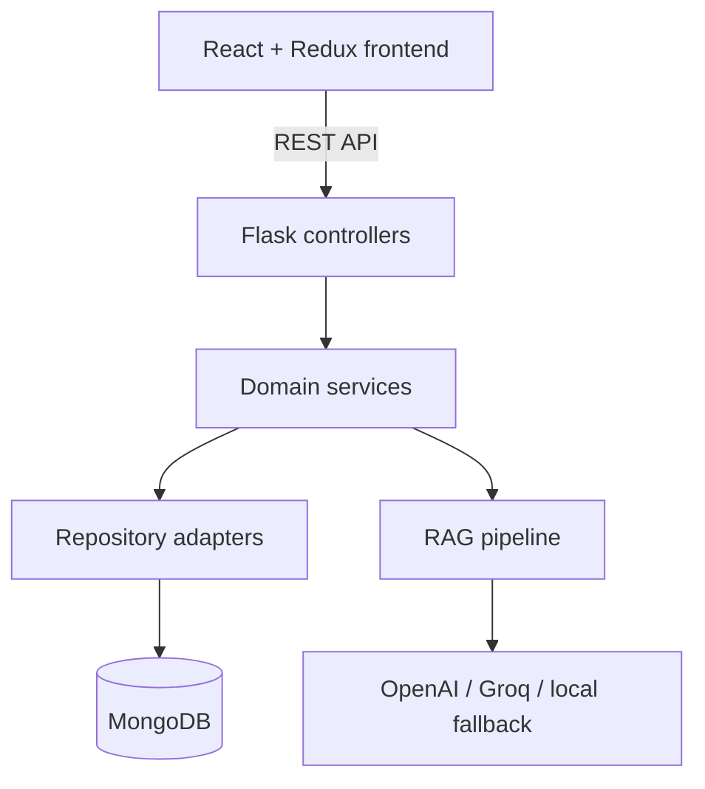
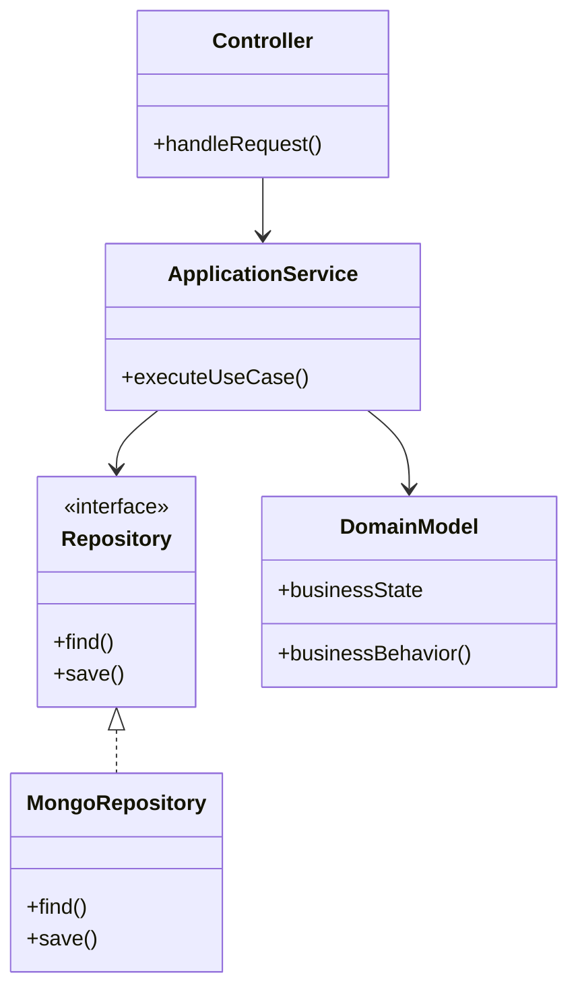
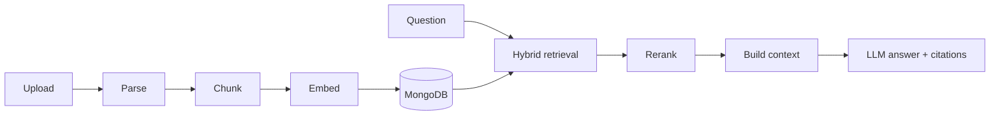

# GATEMIND-AI

An AI-powered learning and assessment platform for GATE aspirants, combining mock examinations, subject-wise performance analytics, personalized learning profiles, and retrieval-augmented generation (RAG) over study material.

[](https://react.dev/)
[](https://flask.palletsprojects.com/)
[](https://www.mongodb.com/)
[](https://www.python.org/)
[](https://www.docker.com/)

## Overview

GATEMIND-AI gives students one place to prepare for GATE through structured mock tests and an AI study assistant. Students can upload notes, textbooks, question banks, and images, ask questions about that material, and receive context-grounded answers with citations. Their mock-test performance is analyzed by subject and incorporated into a personalized learning profile.

The platform also provides an administration workspace for managing users, questions, mock tests, RAG documents, analytics, and storage.

## Key Features

### Student experience

- Registration, OTP verification, login, logout, and password recovery
- JWT access and refresh-token authentication
- Student profile and preparation-progress tracking
- Published mock-test discovery, participation, and submission
- Automatic evaluation with subject-wise performance analysis
- Identification of weak and strong subjects
- Persistent RAG conversations and chat history
- Answers grounded in uploaded documents with source citations
- Upload and query PDF, TXT, Markdown, CSV, JSON, PNG, JPG, JPEG, and WebP files
- Markdown, tables, code, and mathematical-expression rendering

### Administration

- Secure administrator registration and authentication
- Role-aware staff management
- Question-bank and mock-test management
- Test publication and result monitoring
- RAG document indexing and deletion
- User, content, and performance dashboards
- Audit logging and controlled storage cleanup

### AI and retrieval

- Configurable OpenAI, Groq, and Hugging Face integrations
- Deterministic local fallback when external AI credentials are unavailable
- Parser factory for multiple document types
- Recursive document chunking
- Configurable embedding provider
- Hybrid semantic and lexical retrieval
- Metadata and document-level filtering
- Reranking, context construction, and citation generation
- Student-profile-aware response context

## System Architecture



The backend follows a layered structure:

```text
backend/app/
├── controllers/       # Flask blueprints and HTTP request handling
├── models/            # Domain entities and enums
├── repositories/      # MongoDB persistence adapters
├── schemas/           # API serialization
├── services/
│   ├── admin/          # Admin authentication, analytics, and auditing
│   ├── auth/           # Student authentication workflows
│   ├── mocktest/       # Test evaluation and performance analysis
│   ├── notifications/  # SMS and email adapters
│   ├── rag/            # Parsing, chunking, embeddings, retrieval, and LLMs
│   ├── security/       # Password and JWT services
│   ├── users/          # User profile operations
│   └── verification/   # OTP verification
└── utils/              # Middleware, logging, and API response helpers
```

The implementation uses Factory, Strategy, Adapter, Template Method, Builder, repository, and observer-style patterns to keep infrastructure and business logic independently testable.

## Low-Level Design (LLD)

GATEMIND-AI is organized around small, focused classes instead of placing HTTP handling, business rules, database queries, and AI logic in a single module. Its low-level design separates responsibilities through interfaces, service composition, dependency injection, and established design patterns.

### LLD component interaction



Controllers deal with HTTP concerns, application services coordinate use cases, domain models represent business state and behavior, and repository adapters isolate MongoDB operations. This makes it possible to replace an infrastructure dependency without rewriting the core workflow.

### Design patterns used

| Pattern | Project implementation | Why it is used |
|---|---|---|
| Application Factory | `create_app()` in `backend/app/__init__.py` | Creates and configures the Flask application, dependencies, services, and blueprints in one controlled composition root. |
| Repository | `MongoUserRepository`, `MongoQuestionRepository`, `MongoPerformanceRepository`, `MongoRAGRepository` | Keeps database queries outside controllers and business services. |
| Factory | `EmbeddingFactory`, `LLMServiceFactory`, `DocumentParserFactory` | Selects the correct provider or parser at runtime without exposing construction logic to clients. |
| Strategy | Chunking strategies and question-evaluation strategies | Allows one algorithm to be replaced by another through a common contract. |
| Adapter | `MongoVectorStoreAdapter` and Mongo repository adapters | Converts MongoDB-backed operations into interfaces expected by the RAG and domain layers. |
| Template Method | `LangChainIndexingPipeline` | Defines the document-indexing sequence while allowing individual processing steps to vary. |
| Builder | `ContextBuilder` | Constructs the final RAG context from retrieved chunks and student-profile information. |
| Observer-style update | `PersonalizedRAGUpdater` | Updates the student learning profile after mock-test performance changes. |
| Facade | Service-facing import modules and `api` in `frontend/src/lib/api.js` | Provides a simpler entry point to a larger collection of backend or frontend operations. |
| Dependency Injection | Repositories and supporting services passed through constructors | Reduces coupling and makes services easier to test with mocks or alternative implementations. |

### SOLID principles

#### 1. Single Responsibility Principle (SRP)

Each class has one primary reason to change:

- Controllers translate HTTP requests and responses.
- `AuthenticationService` handles authentication workflows.
- `PasswordService` handles password validation and hashing.
- `JWTService` creates and validates tokens.
- `PerformanceAnalyzer` calculates subject-level performance.
- `HybridRetriever` retrieves candidate chunks.
- `HybridReranker` orders retrieved candidates.
- Repositories handle persistence.

For example, changing the password-hashing implementation does not require modifying the authentication controller or user repository.

#### 2. Open/Closed Principle (OCP)

The system is open for extension but closed for modification. A new document parser, embedding provider, LLM provider, chunking algorithm, question evaluator, or vector store can be added through the existing abstraction and factory structure without rewriting the complete pipeline.

For example, support for a new `.docx` parser can be introduced as another parser implementation and registered with `DocumentParserFactory`.

#### 3. Liskov Substitution Principle (LSP)

Implementations that follow the same contract can replace each other without breaking their clients. A retriever can be replaced by another `Retriever` implementation, while a vector-store adapter can be replaced by another implementation that provides the expected add and search operations.

#### 4. Interface Segregation Principle (ISP)

The project uses focused abstractions for parsing, chunking, embeddings, retrieval, reranking, vector storage, and repositories. Components depend only on the behavior they need rather than on one large general-purpose interface.

#### 5. Dependency Inversion Principle (DIP)

High-level services receive repositories and AI components through their constructors. For example, `RAGChatService` depends on injected repository, retriever, reranker, context-builder, LLM, and user components instead of constructing MongoDB and external AI clients internally.

The `create_app()` function acts as the composition root that creates concrete dependencies and wires them together.

### Example: RAG service composition

```python
rag_chat_service = RAGChatService(
    rag_repository,
    HybridRetriever(vector_store, embeddings, top_k),
    HybridReranker(),
    ContextBuilder(),
    llm_service,
    user_repository,
    top_k,
)
```

This constructor-based composition allows a mock retriever or LLM to be supplied during testing and a different production implementation to be used without changing `RAGChatService`.

### Domain separation

The codebase separates major business domains:

| Domain | Main responsibilities |
|---|---|
| Authentication | Registration, login, logout, OTP verification, token refresh, and password reset |
| Users | Profiles, password changes, images, and learning progress |
| Administration | Staff authorization, dashboards, audits, content management, and maintenance |
| Mock tests | Question management, test publication, evaluation, history, and analytics |
| RAG | Document ingestion, embeddings, retrieval, context building, conversations, and citations |

This separation improves cohesion, reduces coupling, and makes the implementation easier to understand, test, extend, and maintain.

### Benefits of the LLD

- Individual components can be unit-tested with mocked dependencies.
- MongoDB, embedding, LLM, and retrieval implementations can evolve independently.
- Controllers remain thin and contain minimal business logic.
- New question types and document formats can be added with limited changes.
- Domain-specific failures are easier to locate and debug.
- Common security operations such as hashing and JWT validation are centralized.

## RAG Pipeline



1. A parser is selected according to the uploaded file type.
2. Extracted content is divided into overlapping chunks.
3. Each chunk is embedded and stored with its source metadata.
4. The student question is embedded at query time.
5. Candidate chunks are ranked using a hybrid score:

   ```text
   score = 0.75 × semantic_similarity + 0.25 × lexical_overlap
   ```

6. Results are reranked and limited to the configured top-k value.
7. The context builder combines retrieved evidence with relevant learning-profile data.
8. The language model generates a context-grounded response with citations.

## Technology Stack

| Layer | Technologies |
|---|---|
| Frontend | React 19, Redux Toolkit, Vite, React Markdown, KaTeX, Lucide React |
| Backend | Python, Flask, Gunicorn, PyJWT, Werkzeug |
| Database | MongoDB, PyMongo, MongoMock for tests |
| AI/RAG | LangChain, OpenAI, Groq, Hugging Face, Sentence Transformers |
| Document processing | PyPDF, optional Pillow and Tesseract OCR |
| Deployment | Docker, Docker Compose, AWS EC2, Vercel, GitHub Actions |

## Repository Structure

```text
GATEMIND-AI/
├── backend/
│   ├── app/                    # Flask application source
│   ├── tests/                  # Unit and integration tests
│   ├── Dockerfile              # Production backend image
│   ├── docker-compose.prod.yml # EC2 production service
│   ├── requirements.txt        # Python dependencies
│   ├── run.py                  # Backend entry point
│   └── run_tests.py            # Test runner
├── frontend/
│   ├── src/                    # React source
│   ├── package.json            # Frontend dependencies and scripts
│   └── vercel.json             # Vercel routing configuration
└── .github/workflows/          # CI/CD workflows
```

## Getting Started

### Prerequisites

- Python 3.10 or newer
- Node.js 20 or newer
- npm
- MongoDB, or MongoMock for local development
- Optional API credentials for OpenAI, Groq, Hugging Face, Twilio, and SMTP

### 1. Clone the repository

```bash
git clone https://github.com/Shayantan1012/GATEMIND-AI.git
cd GATEMIND-AI
```

### 2. Configure and run the backend

```bash
cd backend
python -m venv .venv
```

Activate the virtual environment:

```bash
# Linux or macOS
source .venv/bin/activate

# Windows PowerShell
.venv\Scripts\Activate.ps1
```

Install dependencies and create the environment file:

```bash
pip install -r requirements.txt
cp .env.example .env
```

On Windows PowerShell, use:

```powershell
Copy-Item .env.example .env
```

For development without a MongoDB server, set this in `backend/.env`:

```env
MONGO_USE_MOCK=true
```

Start the API:

```bash
python run.py
```

The backend is available at `http://localhost:5000`. Verify it with:

```bash
curl http://localhost:5000/api/health
```

### 3. Configure and run the frontend

Open another terminal:

```bash
cd frontend
npm install
npm run dev
```

The frontend is available at `http://localhost:5173`.

## Environment Configuration

Copy `backend/.env.example` to `backend/.env` and configure the values needed for your environment.

| Variable | Purpose | Development default/behavior |
|---|---|---|
| `APP_ENV` | Application environment | `development` |
| `SECRET_KEY` | JWT signing secret | Must be changed in production |
| `MONGO_URI` | MongoDB connection string | `mongodb://localhost:27017` |
| `MONGO_DB_NAME` | Database name | `gatemind` |
| `MONGO_USE_MOCK` | Use an in-memory mock database | `false` |
| `ALLOWED_ORIGINS` | Comma-separated CORS origins | `http://localhost:5173` |
| `UPLOAD_FOLDER` | Persistent uploaded-file directory | `backend/uploads` |
| `MAX_CONTENT_LENGTH` | Maximum request size in bytes | 25 MiB |
| `OPENAI_API_KEY` | OpenAI API credential | Optional |
| `OPENAI_CHAT_MODEL` | OpenAI chat model | `gpt-4o-mini` |
| `OPENAI_EMBEDDING_MODEL` | OpenAI embedding model | `text-embedding-3-small` |
| `GROQ_API_KEY` | Groq API credential | Optional |
| `GROQ_MODEL` | Groq chat model | Configurable |
| `HUGGINGFACE_API_KEY` | Hugging Face credential | Optional |
| `RAG_CHUNK_SIZE` | Document chunk size | `900` |
| `RAG_CHUNK_OVERLAP` | Overlap between chunks | `150` |
| `RAG_TOP_K` | Final retrieved-context count | `5` |
| `ADMIN_BOOTSTRAP_TOKEN` | Authorizes later admin registrations | Required for controlled bootstrap |
| `OTP_PREVIEW_ENABLED` | Returns OTP to the UI for development | Keep `false` in production |
| `TWILIO_*` | SMS delivery configuration | Optional |
| `EMAIL_SMTP_*` | Email delivery configuration | Optional |

Never commit `.env`, private SSH keys, API keys, database credentials, or production secrets.

## Main API Routes

### Authentication and users

| Method | Endpoint | Purpose |
|---|---|---|
| `POST` | `/api/auth/register` | Register a student |
| `POST` | `/api/auth/verify-otp` | Verify registration OTP |
| `POST` | `/api/auth/login` | Authenticate a student |
| `POST` | `/api/auth/logout` | End a refresh-token session |
| `POST` | `/api/auth/forgot-password` | Request a password-reset OTP |
| `POST` | `/api/auth/reset-password` | Reset a password |
| `POST` | `/api/auth/refresh-token` | Generate a new access token |
| `GET, PUT` | `/api/users/profile` | Read or update the student profile |
| `GET` | `/api/users/progress` | Retrieve preparation progress |

### Mock tests

| Method | Endpoint | Purpose |
|---|---|---|
| `GET` | `/api/mock-tests` | List published tests |
| `GET` | `/api/mock-tests/<id>` | Retrieve a test |
| `POST` | `/api/mock-tests/<id>/submit` | Submit and evaluate answers |
| `GET` | `/api/mock-tests/history` | Retrieve test history |

### RAG assistant

| Method | Endpoint | Purpose |
|---|---|---|
| `POST` | `/api/rag/documents` | Upload and index student documents |
| `GET` | `/api/rag/documents` | List available documents |
| `POST` | `/api/rag/chat` | Ask a grounded question |
| `GET` | `/api/rag/history` | Retrieve chat history |
| `POST` | `/api/rag/conversations` | Create a conversation |
| `GET` | `/api/rag/conversations` | List conversations |

Administration routes are available below `/api/admin` for staff, user, question-bank, mock-test, dashboard, RAG, audit, and maintenance operations.

## Testing

From the backend directory, run:

```bash
python run_tests.py
```

The test suite covers authentication, OTP verification, admin workflows, question and mock-test management, evaluation, performance personalization, document indexing, retrieval, citations, chat history, and dashboard analytics.

Tests use dependency injection and MongoMock so core workflows can be exercised without an external MongoDB instance.

## Production Deployment

The frontend is designed for Vercel, while the Flask API runs through Gunicorn in a Docker container on AWS EC2. GitHub Actions performs backend validation and deployment.

Production components:

- Vercel-hosted React frontend
- AWS EC2 backend with an Elastic IP
- Docker Compose and Gunicorn
- MongoDB Atlas
- GitHub Actions CI/CD
- Persistent EC2 volume mapping for uploads
- Container health checks through `/api/health`

Follow the detailed guide in [`backend/EC2_DEPLOYMENT.md`](backend/EC2_DEPLOYMENT.md).

For real users, place Nginx in front of the backend, enable HTTPS using a trusted certificate, bind the application port to localhost, restrict CORS to the production frontend, and keep OTP preview mode disabled.

## Security Notes

- Passwords are hashed before persistence.
- Access and refresh tokens have separate lifetimes.
- Production configuration rejects default secrets and mock databases.
- RAG document filters verify student ownership before retrieval.
- Admin bootstrapping is protected by a server-side token.
- CORS responses are restricted to configured origins.
- Upload size is limited by backend configuration.
- OTP preview is a development-only feature and must not be enabled publicly.

For horizontal scaling, temporary OTP and pending-registration state should be moved from process memory to a shared store such as Redis with expiration and attempt limits.

## Roadmap

- MongoDB Atlas Vector Search for scalable approximate nearest-neighbor retrieval
- Cross-encoder or LLM-based reranking
- Redis-backed OTP, session, caching, and rate limiting
- Streaming chatbot responses
- Background document ingestion with a task queue
- Expanded RAG evaluation for faithfulness, relevance, citation accuracy, and latency
- Automated frontend and end-to-end tests
- HTTPS reverse proxy and improved production observability

## Author

**Shayantan Biswas**

- GitHub: [@Shayantan1012](https://github.com/Shayantan1012)
- Repository: [Shayantan1012/GATEMIND-AI](https://github.com/Shayantan1012/GATEMIND-AI)

## Contributing

Contributions and suggestions are welcome. Please open an issue describing the proposed change before submitting a large pull request.

## License

No license has been specified yet. Add a `LICENSE` file before distributing or accepting external contributions under a particular license.
