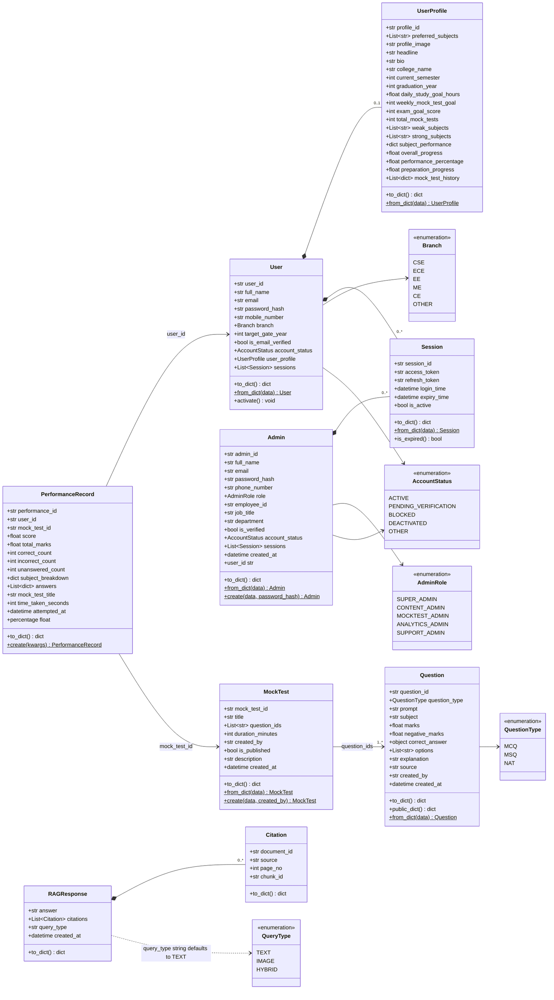
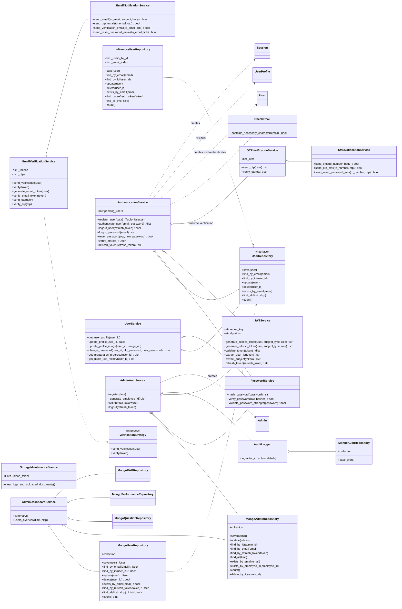
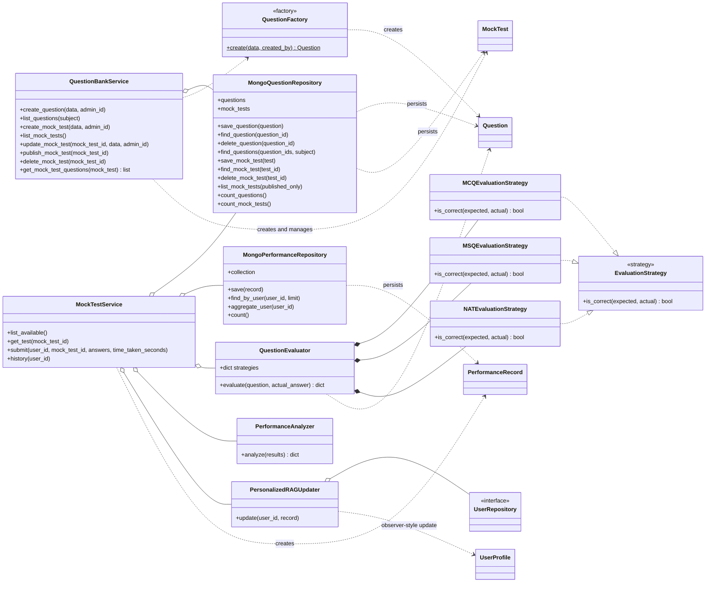
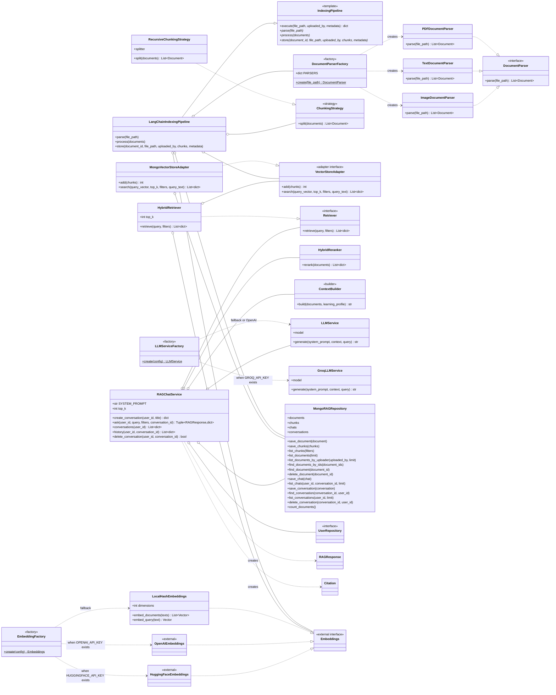
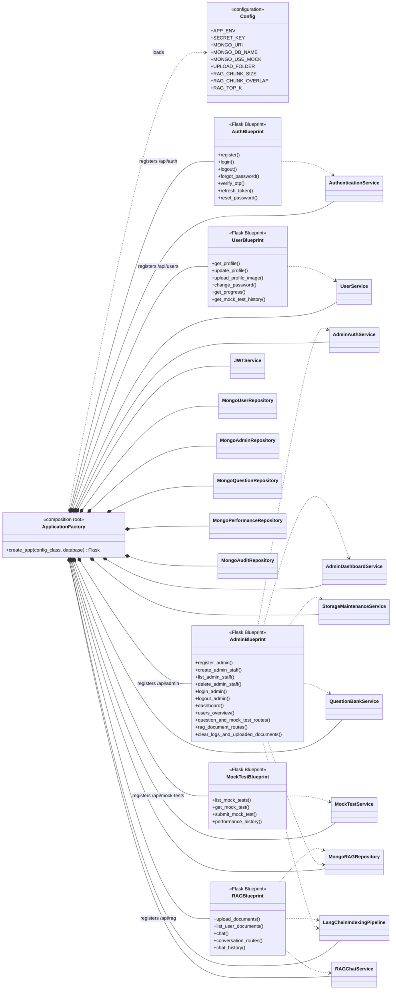

# GATEMIND AI Backend Class Diagram

This document reflects the backend currently implemented under `backend/app`.
It separates the full design into renderable Mermaid class diagrams so that the
relationships remain readable.

## Relationship Legend

- `*--` composition: the owner contains and controls the child lifecycle.
- `o--` aggregation: the class is wired with and uses a collaborator.
- `-->` association: a persistent domain relationship or reference.
- `..>` dependency: creates, calls, serializes, or otherwise depends on.
- `..|>` interface realization.
- `--|>` inheritance.

## 1. Domain Model

## 2. Authentication, User, and Admin Services

`MongoUserRepository` is the runtime adapter. `InMemoryUserRepository`,
`EmailVerificationService`, and `EmailNotificationService` are implemented
alternatives but are not wired by `create_app`.

## 3. Mock-Test Subsystem

## 4. RAG Subsystem

## 5. Runtime Composition and HTTP Boundary

## LLD Concepts Present in the Implementation

| LLD concept | Exact implementation |
| --- | --- |
| Layered architecture | Flask controllers -> application services -> repositories -> MongoDB |
| Dependency injection | `create_app` constructs services and injects collaborators through constructors |
| Repository pattern | `UserRepository`, Mongo repository classes, and `InMemoryUserRepository` |
| Strategy pattern | `EvaluationStrategy` implementations and `ChunkingStrategy` |
| Factory pattern | `QuestionFactory`, `DocumentParserFactory`, `EmbeddingFactory`, `LLMServiceFactory` |
| Adapter pattern | `MongoVectorStoreAdapter` realizes `VectorStoreAdapter`; Mongo repositories adapt persistence |
| Template Method | `IndexingPipeline.execute()` defines parse/process/store; `LangChainIndexingPipeline` implements steps |
| Builder | `ContextBuilder.build()` assembles retrieval context and learning-profile context |
| Observer-style update | `MockTestService.submit()` triggers `PersonalizedRAGUpdater.update()` after saving performance |
| Composition | `User` owns `UserProfile` and `Session`; `Admin` owns `Session`; `RAGResponse` owns citations |
| Role-based access control | `admin_required(*allowed_roles)` validates `AdminRole`; `token_required` validates users |
| Composition Root | `create_app` chooses and wires all runtime implementations into `app.extensions["services"]` |

## Runtime Notes

- The active user repository is `MongoUserRepository`; `InMemoryUserRepository`
  exists but is not selected by `create_app`.
- Authentication currently uses `OTPVerificationService` with
  `SMSNotificationService`. The email verification classes exist but are not
  wired into the runtime graph.
- `EmbeddingFactory` selects OpenAI, Hugging Face, or local deterministic hash
  embeddings from configuration.
- `LLMServiceFactory` selects `GroqLLMService` when `GROQ_API_KEY` exists;
  otherwise it creates `LLMService`, which can use OpenAI when configured or
  return retrieved context without a remote model.
- Files such as `models/enums.py`, `models/rag.py`,
  `repositories/module_repositories.py`, `services/mocktest/evaluation.py`, and
  similar modules are import-only compatibility facades, not additional
  classes.
